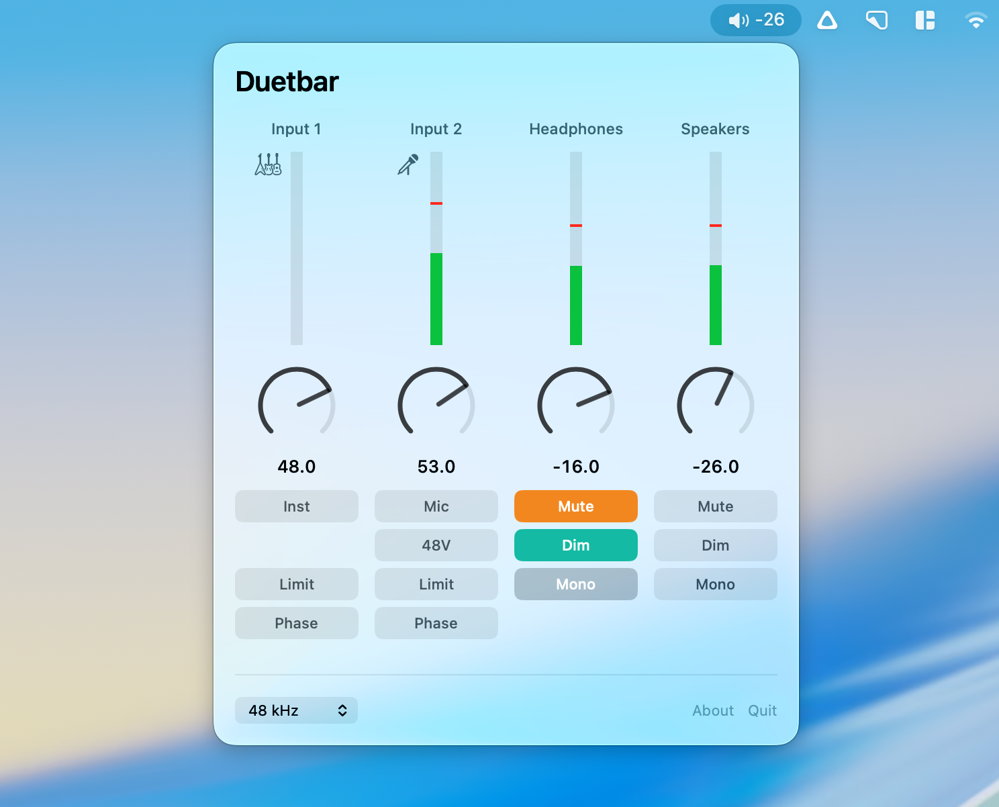

# Duetbar

Menu bar control for the Apogee Duet 2 on macOS.

Apogee Control 2 still runs but isn't updated any more. Duetbar does the parts
you touch every day, from the menu bar, and keeps your levels visible. That last
bit matters if your Duet's screen has died, which is why I wrote it.

**[Download version 0.1.0](https://github.com/mulhoon/duetbar/releases/download/v0.1.0/Duetbar-0.1.0.zip)**

Needs macOS 13 Ventura or later. Universal, so Apple Silicon and Intel both work.
Signed and notarised, so it opens without a Gatekeeper warning.



## What it does

Four channel strips: both inputs, headphones, speakers.

**Meters** on every strip, live at 20 Hz, with a peak hold that sits where the
loudest recent moment was and slides back after a couple of seconds. Green up to
-12, pale green to 0, red above, on the same non-linear scale Apogee Control
uses so the useful top few dB get the room they deserve.

**Dials** for every level. Drag them, or scroll with the pointer over them. Hold
shift for fine adjustment.

**Inputs**: mic, +4 dBu, -10 dBV or instrument, with 48V, soft limit and phase
invert. The icon above each meter follows the source. Gain is stored separately
per mode, and Duetbar only ever writes the mode you're in, which avoids a trap
in the protocol that silently overwrites the other one.

**Outputs**: level, mute, dim and sum to mono, separately for headphones and
speakers.

**Sample rate** from 44.1 up to 192 kHz.

Runs alongside Control 2 quite happily. Change something in one and the other
catches up.

## Shortcuts

| Action | Key |
| --- | --- |
| Mute | ⌃⌥⌘M |
| Dim | ⌃⌥⌘D |
| Volume up | ⌃⌥⌘↑ |
| Volume down | ⌃⌥⌘↓ |

These act on the speakers and work from any app. They don't need Accessibility
permission. If another app has already claimed one, the rest still work.

To change them, edit `HotKeySpec` in `Sources/HotKeys.swift`.

## Install

Download the zip from [Releases](../../releases), unzip it, and drag Duetbar to
your Applications folder. It's signed and notarised, so it opens without any
Gatekeeper warning.

Needs macOS 13 Ventura or later, on Apple Silicon or Intel.

Apogee's software has to be installed, because Duetbar talks to the ApogeeGlue
background service that comes with it. You don't need to run Control 2 itself.

## Build

```sh
./build.sh
open Duetbar.app
```

Needs the Xcode command line tools. This gives you an ad-hoc signed universal
build, which is fine for your own machine.

To cut a release, `scripts/release.sh <version>` signs with a Developer ID
certificate, sends it to Apple for notarisation, staples the ticket and writes
the zip to `dist/`. The icon is generated by `scripts/make-icon.swift` and only
needs rebuilding if the artwork changes.

## How it works

macOS handles the Duet's audio with its own class compliant driver. Hardware
control is a separate thing that goes through `ApogeeGlue`, a background service
Apogee installs. Control 2 is a client of that service, and so is this. Nothing
is patched or replaced.

One warning if you're tempted to skip all that: the Duet advertises standard USB
Audio Class volume and gain controls with ranges that look exactly right. You can
set them and read the changed values back. The firmware ignores them completely.
There's a measurement in [docs/PROTOCOL.md](docs/PROTOCOL.md).

## Protocol

[docs/PROTOCOL.md](docs/PROTOCOL.md) has the wire format, all 22 property IDs and
the meter layout, worked out by watching Control 2 talk to the service. Take it
if you want to build something else, or add another Apogee interface.

## Status

Works on my Duet 2 on Apple Silicon. Property IDs are model specific, so other
Apogee interfaces need their own set, though the protocol itself looks device
independent.

## Unofficial

Not affiliated with Apogee Electronics. Apogee and Duet are their trademarks.

## Licence

MIT
